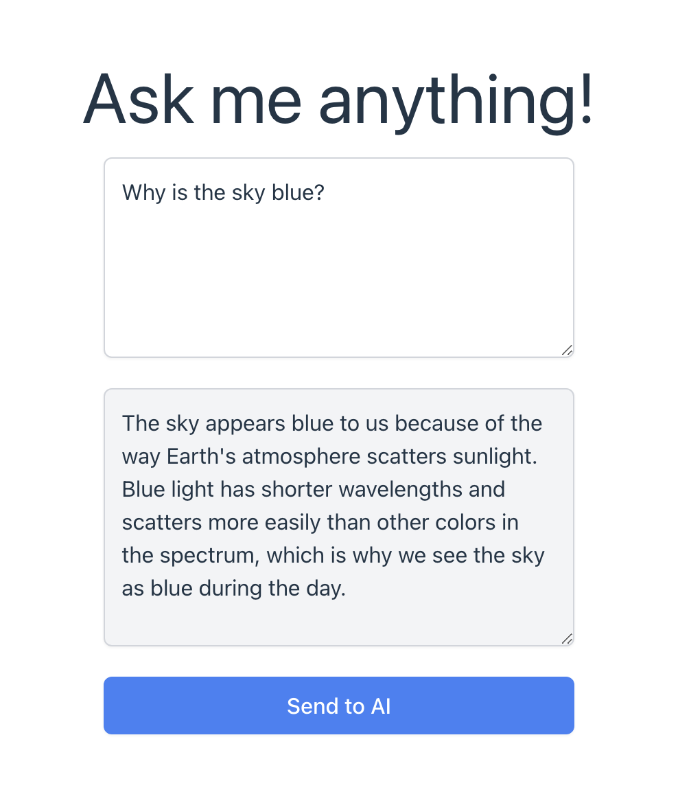

# Frontend for OpenAI Web Project

Welcome to the frontend of the OpenAI Web Project! This is a React application built using Vite, designed to interact with the OpenAI API.



## Overview

This frontend application allows users to input text prompts and receive responses from the OpenAI API. It consists of a simple user interface with an input field, an output field, and a "Send" button.

## Features

- **Responsive Design**: The application is designed to work seamlessly on both desktop and mobile devices.
- **Real-Time Interaction**: Users can submit prompts and see responses in real-time.
- **Modern UI**: Built with React and styled using Tailwind CSS for a clean and modern look.

## Getting Started

To get started with the frontend, follow these steps:

#### Prerequisites

Ensure you have the following installed:

- Node.js (v16 or higher recommended)
- npm or yarn (Node package managers)

#### Installation

1. **Clone the Repository**

   ```bash
   git clone https://github.com/snadering/AI-Assistant-Frontend.git
   ```
2. **Start Web App (Make sure the [backend](https://github.com/snadering/AI-Assistant-Backend#readme) is running)**
   ```bash
   npm run dev
   ```
   